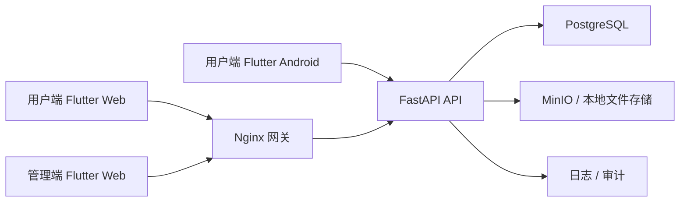

# 心电图学习平台系统架构文档（V1）

## 1. 文档目标

本文档用于明确一期 MVP 的技术架构、模块边界、目录组织、部署方式与设计系统落地方案，作为后续开发与协作的统一基线。

## 2. 当前默认决策

基于上一版需求文档，当前默认采用以下前提继续推进：

- 管理端一期只做 `Web`
- 用户端一期做 `Web + Android`
- 一期采用账号密码登录
- 一期以中文内容为主
- 游客可浏览部分案例，登录后可记录学习进度
- 内容管理员可直接发布，审核流放到二期增强

说明：如果后续业务方向变化，这些前提可以在不推翻整体架构的前提下调整。

## 3. 总体架构



### 3.1 架构说明

- `管理端` 与 `用户端` 分离为两个 Flutter 应用，职责更清晰，后续演进更稳定。
- `用户端` 复用同一套 Flutter 代码，同时适配 Web 与 Android。
- `管理端` 优先支持 Web，不进入 Android 适配范围。
- `后端` 统一由 FastAPI 提供 API、鉴权、内容管理与学习记录能力。
- `数据库` 采用 PostgreSQL 存储业务数据。
- `图片资源` 一期支持本地卷存储，架构上兼容 MinIO。
- `网关层` 负责统一路由用户端 Web、管理端 Web 与后端 API。

### 3.2 Docker 边界说明

- Docker 主要负责管理后端服务、数据库、对象存储与 Web 托管。
- Flutter Web 可通过构建后的静态文件交由 Nginx 托管。
- Android 客户端不是通过 Docker 运行，而是通过 Flutter 构建生成 `APK/AAB` 安装到设备或模拟器。
- 如有需要，后续可以把 Android 构建流程放入 CI 或 Docker 化构建环境，但不作为运行时容器。

## 4. 推荐仓库结构

建议采用 `Monorepo` 结构，统一管理 Flutter、FastAPI、Docker、文档与设计系统资产。

```text
ecg_pro/
  apps/
    admin_app/                # Flutter 管理端（Web）
    user_app/                 # Flutter 用户端（Web + Android）
  packages/
    ecg_ui/                   # 统一 UI 组件库与 Design Tokens 映射
    ecg_core/                 # 公共模型、常量、错误处理、工具层
    ecg_api/                  # API 客户端封装
  services/
    api/                      # FastAPI 后端
  infra/
    docker/                   # Dockerfile 与 compose 配置
    nginx/                    # 网关与静态资源路由配置
    scripts/                  # 启动、初始化、导入脚本
  docs/
    requirements.md
    architecture.md
    development-plan.md
  .env.example
  README.md
```

## 5. 前端架构设计

### 5.1 应用拆分策略

### `apps/user_app`
- 面向学习用户
- 支持 `Web`
- 支持 `Android`
- 功能包括：首页、案例库、案例详情、测验、收藏、错题本、学习记录、个人中心

### `apps/admin_app`
- 面向管理员
- 仅支持 `Web`
- 功能包括：登录、仪表盘、案例管理、分类标签管理、题目管理、图片上传、发布管理

### `packages/ecg_ui`
- 统一颜色、字体、圆角、阴影、间距等设计规范
- 提供按钮、卡片、列表、标签、输入框、弹窗、顶部栏、底部导航等基础组件
- 提供用户端与管理端通用的页面骨架与状态组件

### `packages/ecg_core`
- 公共枚举、实体模型、分页模型、异常模型
- 公共工具方法
- 公共业务常量，如风险等级、案例状态、题型、难度等级

### `packages/ecg_api`
- API 请求封装
- Token 处理
- 请求拦截与错误统一处理
- 后端 DTO 与前端模型转换

### 5.2 前端模块边界

### 用户端模块
- `auth`：登录、退出、游客态切换
- `home`：首页推荐、最近学习、每日练习
- `case_library`：案例列表、筛选、搜索、排序
- `case_detail`：案例详情、图片查看、知识点展示
- `quiz`：答题、判题、结果页、错题重练
- `learning`：学习记录、收藏、错题本、掌握情况
- `profile`：个人信息、设置、免责声明

### 管理端模块
- `admin_auth`：管理员登录与权限控制
- `dashboard`：概览看板
- `case_management`：案例新增、编辑、删除、发布
- `media_management`：图片上传、图片选择、封面管理
- `taxonomy_management`：分类、子分类、标签管理
- `quiz_management`：题目管理与绑定

### 5.3 前端架构风格

一期推荐采用“按功能模块划分”的 Flutter 工程结构，每个模块内部统一分为：

- `presentation`：页面、组件、状态展示
- `application`：状态管理、交互编排
- `domain`：实体、规则、业务抽象
- `infrastructure`：API 调用、数据适配、缓存

说明：这样既能避免过重的“纯理论分层”，也方便后续随着模块增长逐步增强。

### 5.4 Web 与 Android 适配原则

- 用户端页面需要优先支持移动端，再兼容 Web 宽屏
- 案例详情页在移动端采用纵向阅读布局，在 Web 端可采用双栏信息布局
- 图片查看支持放大与横向滑动切换
- 测验页优先保证移动端单手操作
- 管理端按桌面浏览器体验设计，不强求移动端后台

## 6. UI 设计系统架构

### 6.1 设计目标

- 风格清新、轻量、专业
- 参考 Apple 风格的克制感与留白，但保留医学学习产品的专业气质
- 避免复杂装饰，重点保证信息层次、图片可读性与学习效率

### 6.2 设计系统层级

### Design Tokens
- `color`
- `typography`
- `spacing`
- `radius`
- `shadow`
- `border`
- `motion`

### Foundation Components
- Button
- TextField
- SearchBar
- Tag
- Chip
- Card
- SectionHeader
- EmptyState
- ErrorState
- Pagination
- Dialog
- Toast

### Business Components
- ECGCaseCard
- ECGCaseRiskBadge
- ECGImageViewer
- DiagnosisSummaryCard
- QuizOptionCard
- QuizResultPanel
- ProgressOverviewCard

### 6.3 Figma 到 Flutter 的落地原则

- Figma 用于维护视觉稿、组件库、变量与页面原型
- `packages/ecg_ui` 作为代码侧的统一 UI 实现
- Figma 变量命名需尽量与 Flutter Theme Token 保持一致
- 页面开发优先从组件库拼装，避免页面中散落硬编码颜色与间距
- 后续可使用 Figma MCP 协助沉淀组件库与页面原型，但代码最终仍以仓库内 `ecg_ui` 为准

## 7. 后端架构设计

### 7.1 后端模块划分

建议将 FastAPI 按业务域拆分：

- `auth`：登录、Token、权限、当前用户
- `users`：用户资料、角色、管理员
- `cases`：案例管理、案例查询、案例详情
- `categories`：分类、子分类、标签
- `media`：图片上传、图片元数据
- `quizzes`：题目、选项、测验结果
- `learning`：学习进度、收藏、错题本
- `admin`：管理端聚合接口、仪表盘数据
- `system`：健康检查、配置、版本信息

### 7.2 后端分层建议

每个模块建议按如下结构组织：

```text
services/api/app/
  main.py
  core/               # 配置、鉴权、中间件、日志
  db/                 # 数据库连接、基类、迁移入口
  modules/
    cases/
      router.py
      schemas.py
      service.py
      repository.py
      models.py
```

### 分层职责
- `router.py`：定义 API 路由与请求响应
- `schemas.py`：定义输入输出模型
- `service.py`：承载业务流程
- `repository.py`：负责数据库读写
- `models.py`：ORM 模型定义

## 7.3 一期后端核心能力

- JWT 鉴权
- 用户与管理员角色控制
- 案例内容 CRUD
- 图片上传与访问地址生成
- 分类/标签维护
- 题目管理
- 用户答题提交
- 学习进度记录
- 收藏与错题本

## 8. 数据模型概要

一期建议至少包含以下核心表：

### 用户与权限
- `users`
- `roles`
- `user_roles`
- `refresh_tokens`

### 内容域
- `ecg_cases`
- `ecg_case_images`
- `categories`
- `tags`
- `ecg_case_tags`

### 测验域
- `quiz_questions`
- `quiz_question_options`
- `quiz_attempts`
- `quiz_attempt_items`

### 学习域
- `learning_progress`
- `favorites`
- `wrong_questions`
- `recent_views`

### 管理与审计
- `audit_logs`
- `file_assets`

### 8.1 `ecg_cases` 建议字段

- `id`
- `case_code`
- `title`
- `summary`
- `category_id`
- `difficulty`
- `risk_level`
- `diagnosis`
- `rhythm_type`
- `heart_rate`
- `axis_description`
- `pr_description`
- `qrs_description`
- `st_t_description`
- `qt_description`
- `key_leads`
- `clinical_significance`
- `differential_diagnosis`
- `treatment_plan`
- `urgent_actions`
- `follow_up_recommendations`
- `detailed_description`
- `interpretation_steps`
- `learning_points`
- `common_mistakes`
- `memory_tips`
- `status`
- `is_featured`
- `created_by`
- `published_at`
- `created_at`
- `updated_at`

说明：部分长文本字段可以先用 `TEXT/JSON` 存储，一期先保证录入效率和读取稳定性。

## 9. API 设计原则

### 9.1 API 前缀

- `/api/v1/auth`
- `/api/v1/admin/*`
- `/api/v1/public/*`
- `/api/v1/user/*`

### 9.2 API 范围建议

### 鉴权相关
- `POST /api/v1/auth/login`
- `POST /api/v1/auth/refresh`
- `POST /api/v1/auth/logout`
- `GET /api/v1/auth/me`

### 管理端案例相关
- `GET /api/v1/admin/cases`
- `POST /api/v1/admin/cases`
- `GET /api/v1/admin/cases/{id}`
- `PUT /api/v1/admin/cases/{id}`
- `DELETE /api/v1/admin/cases/{id}`
- `POST /api/v1/admin/cases/{id}/publish`
- `POST /api/v1/admin/cases/{id}/offline`

### 用户端案例相关
- `GET /api/v1/public/cases`
- `GET /api/v1/public/cases/{id}`
- `GET /api/v1/public/categories`
- `GET /api/v1/public/tags`

### 题库与学习
- `GET /api/v1/public/cases/{id}/quiz`
- `POST /api/v1/user/quiz/submit`
- `GET /api/v1/user/learning/progress`
- `POST /api/v1/user/favorites/{case_id}`
- `GET /api/v1/user/wrong-questions`

## 10. 部署与环境方案

### 10.1 本地开发环境

建议本地开发采用以下模式：

- `docker compose` 启动 `api + postgres + minio + nginx`
- Flutter 用户端本地运行调试：
  - Web：浏览器调试
  - Android：模拟器/真机调试
- Flutter 管理端本地运行 Web 调试

这样可以兼顾开发效率与服务环境一致性。

### 10.2 测试/演示环境

- 后端与数据库通过 Docker Compose 部署
- 用户端 Web 构建后由 Nginx 托管
- 管理端 Web 构建后由 Nginx 的独立路由托管
- Android 通过测试包分发安装

### 10.3 推荐服务清单

- `postgres`
- `api`
- `minio`
- `nginx`
- `user_web` 构建镜像
- `admin_web` 构建镜像

说明：本地调试阶段可不强制把 Flutter 前端放进容器运行，正式环境再进入静态构建与托管流程。

## 11. 安全与内容治理

- 后台接口必须鉴权
- 上传文件限制大小、后缀与 MIME 类型
- 核心操作写入审计日志
- 公开案例默认脱敏
- 页面展示免责声明，强调教学用途
- 后续可加入案例版本记录与回滚机制

## 12. 测试策略

### 前端
- 组件测试
- 核心页面快照或 Golden 测试
- 关键流程集成测试

### 后端
- Service 层单元测试
- API 集成测试
- 权限校验测试
- 文件上传测试

### 联调
- 登录流程
- 案例发布到前台可见流程
- 用户学习到测验提交流程
- 收藏与错题记录流程

## 13. 一期开发顺序建议

1. 先搭建 Monorepo 目录与基础工程
2. 再搭建 FastAPI 基础骨架与数据库迁移
3. 同步建设 `ecg_ui` 组件库与设计 Token
4. 优先完成管理端案例管理闭环
5. 再完成用户端学习与测验闭环
6. 最后完成部署、联调、测试与文档补全

## 14. 架构结论

一期最合适的方案是：

- 采用 `Monorepo`
- 使用两个 Flutter 应用分别承载管理端与用户端
- 用共享 package 沉淀统一 UI 库、公共模型与 API 层
- 用 FastAPI 提供单一后端服务
- 用 PostgreSQL + MinIO 承载数据与图片
- 用 Docker Compose 统一服务环境

这样可以兼顾：

- Flutter 多端复用
- 管理端与用户端职责清晰
- 后续可扩展到 iOS、审核流、统计报表和 AI 能力
